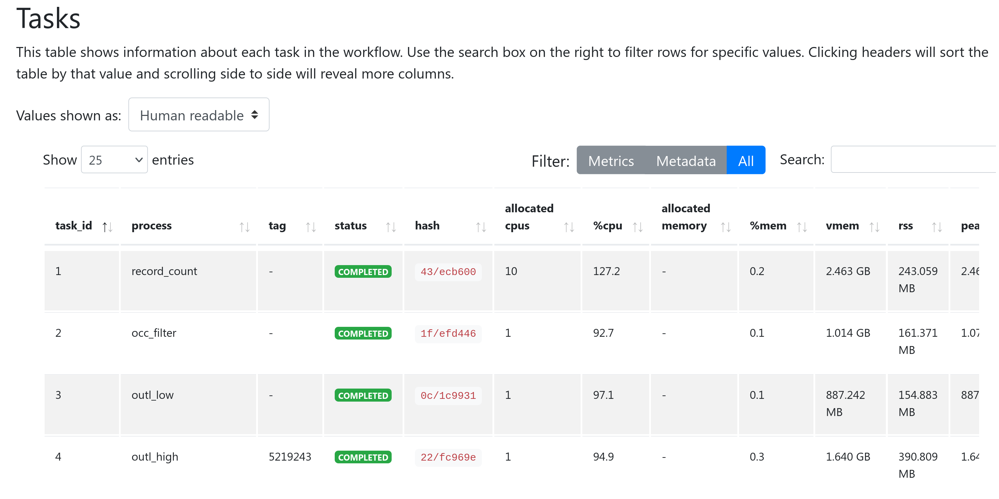

# PhyloNext output

## Diversity estimates in tabular format

Table `03.Plots/Biodiverse_results_merged.txt`

## Interactive map with diversity values

The leaflet-based map is located in `03.Plots/Choropleth.html`.  

As a small example (based on the Acacia dataset from Australia, H3 resolution = 3), a map will look like this:  

 <iframe width=800, height=600 frameBorder=0 src="/assets/Leaflet_map_h3.html"></iframe>

You may toggle selectors at the top-right corner to show the results for a particular diversity metric on the map. 
In the example, there are three indices available:  

- `RICHNESS_ALL`, observed species richness;  
- `SES_PD`, the effect size for the phylogenetic diversity;  
- `CANAPE`, centers of neo- and paleo-endemism (according to the CANAPE analysis; see [Mishler et al., 2020](https://onlinelibrary.wiley.com/doi/full/10.1111/jse.12590) for details).  

Use the pipeline's `--leaflet var` parameter to specify which indices will be displayed on a map. 

## GeoPackage

Diversity estimates and H3 polygons are also exported into the GeoPackage file (`03.Plots/Diversity_estimates.gpkg`). 
[OGC GeoPackage](https://www.geopackage.org/) is a relatively new, open standard data format for storing geospatial data. 
It is designed to be an efficient, portable, compact, and self-contained format that can store and exchange data within a single file. 

GeoPackage is supported in most modern GIS software packages (e.g., [QGIS](https://www.qgis.org)). 
See the example of opening GeoPackage in QGIS [in the post-processing section](post.md).

!!! info "Why not shapefiles?"
    More information on the comparisons of different formats for storing geospatial data can be found here:  
    [http://switchfromshapefile.org/](http://switchfromshapefile.org/)

## Dataset information

The pipeline output contains two files with references to the original data sources, 
which can be used for citing the data and giving proper credit to the original data providers 
who collected and curated the data.  

Species occurrences - `results/pipeline_info/Dataset_DOIs.txt`  
Phylogenetic tree - `02.OTT_tree/citations.txt`  

The `Dataset_DOIs.txt` file also contains Digital Object Identifiers (DOIs) for the datasets, 
which can be used to create a derived dataset of species occurrences. 
For more information, see the `Derived datasets` paragraph in [the post-processing section](post.md).

## Pipeline summary

In the `results/pipeline_info` directory, there are pipeline execution reports created by Nextflow. 
These files in HTML format includes the workflow report and execution timeline for each process.  

**Workflow report** contains many useful metrics about pipeline execution.  

In particular, the *Resources* section plots the distribution of resource usage (CPU, memory, job duration, and disk I/O) 
for each workflow process using the interactive [plotly.js](https://plot.ly/javascript/) plotting library. 
The plots have several tabs with the raw values and a percentage representation showing what proportion of the requested resources were used. 
These plots are very helpful in checking that task resources are used efficiently.
{ align=left }  

The *Tasks* section lists all executed tasks, reporting the status, the actual command script, and many other metrics for each of the tasks. 
The same information is also stored in a tabular format in tab-delimited format (e.g., `execution_trace_*.txt`).
{ align=left }  

**Execution tracing file** contains helpful information about each process, including submission time, start time, completion time, CPU, and memory used.
{ align=left }  

!!! info "Resource usage metrics"
    To learn more about how resource usage is computed by Nextflow, see:  
    [https://www.nextflow.io/docs/latest/tracing.html#trace-report](https://www.nextflow.io/docs/latest/tracing.html#trace-report) and  
    [https://www.nextflow.io/docs/latest/metrics.html#metrics-page](https://www.nextflow.io/docs/latest/metrics.html#metrics-page)

