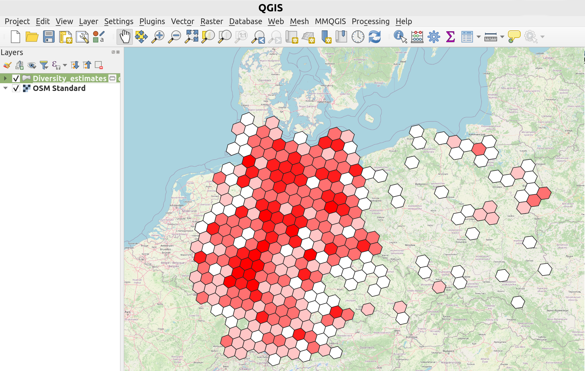

# PhyloNext results exploration and analysis

- Manually configure static map using the output in GeoPackage format  
- Explore the results using Biodiverse program  
- Prepare citable derived dataset with unique DOI

## Constructing maps using the output in GeoPackage format 

[GeoPackage](https://www.geopackage.org/) is an open format to store geospatial information. 
It allows to store vector features (e.g., H3 polygons) along with their attributes (e.g., diversity estimates).
As one of the outputs, PhyloNext provides `03.Plots/Diversity_estimates.gpkg` file, 
which could be easily exported and visualized in your favorite GIS software.

For example, you may use a free and open source application [`QGIS`](https://qgis.org/en/site/) to open a GeoPackage file.
{ align=left }

## Results exploration with Biodiverse program 

`Biodiverse` is a program for the spatial analysis of diversity which performs all the hard work for PhyloNext. 
By default, PhyloNext output in Biodiverse format is stored in the `02.Biodiverse_results/Biodiverse.bds` file. 
This file could be exported to Biodiverse and visualized using graphical user interface.

{ align=left }

!!! info "Biodiverse installation"
    Please follow [this guide](https://github.com/shawnlaffan/biodiverse/wiki/Installation) to install Biodiverse.

For more details on visualization of spatial analysis results on the phylogenetic tree, see these two blog posts (
[1](https://biodiverse-analysis-software.blogspot.com/2017/09/visualise-spatial-analysis-results-on.html) and 
[2](http://biodiverse-analysis-software.blogspot.com/2014/10/new-tree-plots-in-biodiverse.html) ) 
by Shawn Laffan.

## Derived datasets

[Derived datasets](https://www.gbif.org/derived-dataset/about) are citable records (with a unique DOI) 
representing GBIF-mediated species occurrences that has been filtered significantly. 
To create a derived dataset, PhyloNext provides a table with a list of the GBIF datasets (defined as `datasetKey`) from which the data originated.

User can register new derived dataset at GBIF.org following this link:  
[https://www.gbif.org/derived-dataset](https://www.gbif.org/derived-dataset)

For additional information please see [this GBIF blog post](https://data-blog.gbif.org/post/derived-datasets/) by Daniel Noesgaard.

